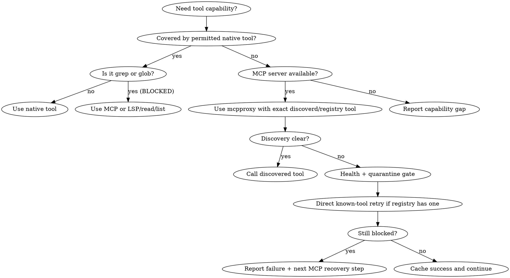

# MCP-Augmented Tool Discipline

## Core Principle

Use native tools for native capabilities when permitted. Use MCP tools for capabilities not covered by native tools, or when MCP provides materially better context, safety, or integration.

Native tools (when permitted by the user's permission config): `read`, `list`, `edit`, `lsp`, `question`, `todowrite`, `skill`, `bash` (when allowed).

**Disabled native tools (never use):** native `grep` and native `glob` remain disabled. Use codebase-memory MCP, IDE search MCP, LSP symbols/references, `read`/`list`, or approved MCP search tools instead.

**Available IDE MCP servers:** `rider-official:*`, `webstorm-official:*`, `phpstorm-official:*`. Check the registry for the exact tool available on each.

## Mandatory Companion Skill

`mcp-tool-registry` is the recommended exact-tool cache for MCP-backed actions. It provides verified `server:tool` names, mcpproxy wrappers, argument templates, and per-tool guard notes.

- Load `mcp-tool-registry` before the first MCP-backed action when exact MCP tool names or wrappers are needed.
- Do not require it for tasks that only use native tools.
- If the runtime cannot auto-load dependencies from frontmatter, manually load `mcp-tool-registry` before the first MCP call.

## Tool Selection Policy

Classify each capability before choosing tools:

### Native-First (use native tools when permitted)

| Capability | Native tool | When to use MCP instead |
| --- | --- | --- |
| Read files | `read` | Use MCP when IDE diagnostics/context is needed alongside read, or when reading through an IDE session that has project indexing |
| Edit files | `edit` | Use IDE MCP for multi-file refactors with formatting/diagnostics integration |
| List directories | `list` | Use MCP when IDE project tree context matters |
| Permitted bash commands | `bash` | Use MCP terminal when IDE toolchain integration (build/test runner) provides better output or session context |
| LSP diagnostics | `lsp` | Use IDE MCP for richer diagnostics with quick-fix context |

### MCP-Preferred (prefer MCP over native)

| Capability | Preferred MCP server | Notes |
| --- | --- | --- |
| Structural code discovery | `codebase-memory-mcp:*` | Functions, classes, routes, call chains, architecture. Preferred over any search for structural questions. |
| IDE diagnostics/refactors | `rider-official:*` / `webstorm-official:*` / `phpstorm-official:*` | IDE-backed inspections, reformats, symbol info, run configurations |
| IDE file operations | `rider-official:*` / `webstorm-official:*` / `phpstorm-official:*` | Create/edit/delete with IDE undo, formatting, and project indexing |
| IDE search within projects | `rider-official:*` / `webstorm-official:*` / `phpstorm-official:*` | IDE-indexed text/regex search, structural search, symbol search |
| Browser automation | `chrome-devtools:*` / `playwright:*` | Navigate, snapshot, console/network, screenshots, form interactions |
| Documentation lookup | `context7:*` | Library docs, API references |
| Source code search (non-structural) | `codebase-memory-mcp:search_code` | Graph-augmented grep for string literals, error messages, config values — ranked by structural importance |
| GitHub/remote services | `github:*` | Repositories, issues, PRs, Actions, remote file operations |
| Cloud APIs / CI/CD | relevant MCP servers | External integrations through dedicated MCPs |
| Databases | MCP database servers | Schema inspection, queries, migrations |
| Git VCS | `git-mcp-server:*` | Status, diff, log, blame |

### Disabled Native Tools (never use)

| Disabled tool | Use instead |
| --- | --- |
| Native `grep` | codebase-memory MCP (`search_graph`, `search_code`), IDE search MCP, LSP symbols/references, `read`/`list` for targeted inspection |
| Native `glob` | IDE file lookup MCP, `list` with targeted paths, MCP file-search tools |

Do not use shell commands to bypass disabled native tools.

## Codebase Knowledge Graph Guidance

When `codebase-memory-mcp` tools are available, they are the recommended first choice for structural code discovery. They provide context that raw text search cannot match and are extremely fast.

### Priority Order for Code Discovery

1. `codebase-memory-mcp:search_graph` — find functions, classes, routes, variables by pattern
2. `codebase-memory-mcp:trace_path` — trace who calls a function or what it calls
3. `codebase-memory-mcp:get_code_snippet` — read specific function/class source code
4. `codebase-memory-mcp:query_graph` — run Cypher queries for complex patterns
5. `codebase-memory-mcp:get_architecture` — high-level project summary

### When to Use Other Tools

| Situation | Use |
| --- | --- |
| Searching for exact string literals, config values, error messages | `codebase-memory-mcp:search_code` (graph-augmented grep) |
| Searching non-code files (Dockerfiles, shell scripts, configs) | MCP IDE search, or `read`/`list` for targeted paths |
| Reading known file contents | Native `read` (when permitted) |
| Graph tools return insufficient results | Narrow with `file_pattern`/`path_filter`; if still insufficient, use IDE MCP search or `read`/`list` with targeted paths |
| `codebase-memory-mcp` is not available | Use IDE MCP search, LSP symbols/references, or `read`/`list` |

### Usage Examples

- Find a handler: `codebase-memory-mcp:search_graph(query="OrderHandler", project="<project-root>")`
- Who calls it: `codebase-memory-mcp:trace_path(function_name="OrderHandler", direction="inbound", project="<project-root>")`
- Read source: `codebase-memory-mcp:get_code_snippet(qualified_name="pkg/orders.OrderHandler", project="<project-root>")`

## First 30 Seconds

1. Determine whether the task can be done with permitted native tools.
2. If yes and the task does not need grep/glob, use native tools.
3. If the task needs a non-native capability, or native grep/glob would normally be the obvious tool:
   - For structural code questions: use `codebase-memory-mcp` graph tools.
   - For other non-native capabilities: load `mcp-tool-registry`, run `mcpproxy_retrieve_tools`, and use the discovered or registry-cached exact `server:tool`.
4. For unknown or disputed MCP capabilities, run `mcpproxy_retrieve_tools` before first use.
5. If discovery is missing, unclear, or contradictory, use the health/security gate.
6. Include `intent_reason` and `intent_data_sensitivity` on every proxied MCP call.

## Non-Negotiable Contract

- **Do not use disabled native tools:** `grep` and `glob` are forbidden.
- **Do not guess MCP tool names.** Use only exact names returned by discovery, listed in `mcp-tool-registry`, or proven by a successful call earlier in the same session.
- **Use the discovered/cached mcpproxy wrapper only for MCP calls:**
  - `call_tool_read` / `call: read` → `mcpproxy_call_tool_read`
  - `call_tool_write` / `call: write` → `mcpproxy_call_tool_write`
  - `call_tool_destructive` / `call: destructive` → `mcpproxy_call_tool_destructive`
- **Treat wrapper choice as routing, not safety.** Some write-like tools may currently route through the read wrapper. Obey registry `risk`/`guard` notes and user-confirmation rules anyway.
- **Every proxied MCP call includes audit intent:**
  - `intent_reason`: why this call is needed for the current user request.
  - `intent_data_sensitivity`: `public`, `internal`, `private`, or `unknown`.
- **Continue truncated MCP results** with `mcpproxy_read_cache`.
- **Do not stage, commit, push, delete, remote-write, or run destructive operations** unless the current user request explicitly asks for that action or confirms it after you ask.
- **Do not use shell commands to bypass disabled native tools or permission policy.**

## Tool-Selection Examples

| Situation | Correct behavior |
| --- | --- |
| "I need to read this file." | Use native `read` (permitted). |
| "I need to edit this file." | Use native `edit` when permitted; use IDE MCP for multi-file refactors needing formatting/diagnostics. |
| "I need to find where `OrderHandler` is defined." | Use `codebase-memory-mcp:search_graph`. |
| "I need to trace callers of this function." | Use `codebase-memory-mcp:trace_path`. |
| "I want to run the tests." | Use permitted `bash` or IDE MCP test runner. |
| "I need IDE diagnostics on this file." | Use IDE MCP diagnostics tool. |
| "I need to interact with a browser." | Use browser MCP (`chrome-devtools:*` or `playwright:*`). |
| "I need to look up library docs." | Use `context7:*` MCP. |
| "I need to interact with GitHub." | Use `github:*` MCP. |
| "I need to query the database." | Use database MCP tools. |
| "I'll just `grep`/`rg` for this." | BLOCKED. Use `codebase-memory-mcp:search_graph`, `codebase-memory-mcp:search_code`, IDE MCP search, LSP, or `read`/`list` with targeted paths. |
| "I'll just `glob`/`find` for files." | BLOCKED. Use IDE MCP file lookup, `list` with targeted paths, or MCP file-search. |
| "MCP is unavailable, let me use grep." | BLOCKED. Report MCP failure; use LSP, `read`/`list`, or ask for narrower context. Do not use grep/glob. |

## Session MCP Cache Template

Maintain a session-local cache after every successful MCP discovery, registry lookup, or direct call:

```text
Session MCP cache entry:
- capability:
- server:tool:
- wrapper: mcpproxy_call_tool_read | mcpproxy_call_tool_write | mcpproxy_call_tool_destructive
- key args: projectPath / owner+repo / workingDirectory / etc.
- risk/guard:
- source: fresh discovery | mcp-tool-registry | successful direct call
```

Use the cache to avoid repeated discovery. Do not use it to bypass safety gates or fresh schema conflicts.

## Decision Flow (Native-First)



## MCP Discovery and Cache Policy

Use MCP discovery for unknown MCP capabilities, not for every call. Maintain a session-local cache of exact `server:tool` names, wrappers, and required argument patterns after successful discovery, registry lookup, direct-call success, or tool/security inspection.

When MCP capability is uncertain, run up to three narrowing discovery queries:

1. Broad capability query.
2. Server-scoped query.
3. Action-scoped query with likely tool words.

If results are still sparse or irrelevant, run one sanity pass with `include_stats=true`. Do not infer unavailability from one poor retrieval result.

## Registry Tie-Breaker for Retrieval Misses

Retrieval can be noisy. Before declaring a known MCP capability unavailable:

1. Complete the discovery/cache policy above.
2. Check relevant exact entries in `mcp-tool-registry`.
3. Confirm server health with `mcpproxy_upstream_servers`.
4. Confirm quarantine/tool state with `mcpproxy_quarantine_security`.
5. If the registry contains an exact likely tool, attempt one direct call with that exact `server:tool` and cached wrapper only when the action is read-only or already allowed by the current user request and registry guard.
6. If that call fails, include the raw error in the MCP Failure Protocol.

Never use a registry tie-breaker to perform a destructive, remote-write, VCS-write, browser-mutation, or code-execution action without explicit current user intent.

After a direct registry invocation succeeds, cache that tool and wrapper for the rest of the session.

## Health and Security Gate

Run this MCP gate whenever discovery is missing, unclear, contradictory, or a cached tool fails unexpectedly:

1. `mcpproxy_upstream_servers` to inspect configured servers and connection state.
2. `mcpproxy_quarantine_security` for the relevant server/tool state.
3. If the server is disabled, quarantined, missing credentials, or unhealthy, stop and report the MCP recovery step.

Never bypass quarantine or security status by using a local fallback.

## Routing Sources of Truth

Use these in order:

1. Current user instruction and repository guidance (`AGENTS.md`, project skills, explicit task constraints).
2. If the task needs MCP: fresh `mcpproxy_retrieve_tools` output for exact tool names, wrappers, and schemas.
3. `mcp-tool-registry` for stable exact names and argument templates.
4. Successful MCP calls cached earlier in this session.

If fresh discovery conflicts with the registry, fresh discovery wins for wrapper/schema. Do not keep retrying the stale registry entry. Use the fresh schema if found, and note that the registry needs an update.

## Safety Gates for High-Impact Actions

These require explicit current user intent, regardless of tool type (native or MCP):

| Action type | Requirement |
| --- | --- |
| File edits/creation/formatting | User requested the change; read back or inspect after editing. |
| Test/build/run commands | User requested verification or execution; state that code/processes may run. |
| Stage/commit/push | User explicitly requested staging, committing, or pushing in this task. |
| Deletes/destructive operations | Ask for confirmation unless the user already gave precise destructive instruction. |
| Remote writes/API mutations | Require explicit current request; prefer dry-run/read checks first. |
| Browser JavaScript/forms/clicks | Keep inspection read-only unless mutation is requested. |

## MCP Failure Protocol

When an MCP-only capability fails:

1. **If native tools can solve the task and are permitted**, continue with native tools (provided they are not `grep`/`glob`).
2. **If the task requires a capability only available through MCP** and MCP fails, STOP and output this 5-part report:
   - **Discovery Queries:** exact `mcpproxy_retrieve_tools` queries used.
   - **Registry Entries Checked:** exact `server:tool` entries considered from `mcp-tool-registry`.
   - **Server Health:** relevant `mcpproxy_upstream_servers` status.
   - **Security Status:** relevant `mcpproxy_quarantine_security` state.
   - **Failing Tool Evidence + Next MCP Recovery Step:** exact tool, wrapper, raw error, and one next step: auth, restart, enable, unquarantine, install/configure server, narrower rediscovery, user confirmation, or registry refresh from fresh schema.
3. **Do not fall back to `grep`/`glob`.** If the only obvious native path would require them, use codebase-memory MCP, IDE MCP, LSP, `read`/`list`, or ask for a narrower target.
4. **Do not bypass MCP for external services, databases, browser automation, or GitHub** if those capabilities require MCP credentials, session state, or integration-specific safety.

## Common Mistakes

| Severity | Mistake | Correct behavior |
| --- | --- | --- |
| BLOCKER | Using native `grep` or `glob` | These are disabled. Use codebase-memory MCP, IDE search MCP, LSP, `read`/`list`, or ask for narrower context. |
| BLOCKER | Forcing MCP for simple native reads/edits when native tools are allowed and sufficient | Use permitted native `read`/`edit` for straightforward file operations. |
| BLOCKER | Guessing a `server:tool` name | Use discovery, registry, or session cache only. |
| BLOCKER | Missing MCP intent metadata | Add `intent_reason` and `intent_data_sensitivity` on every proxied MCP call. |
| BLOCKER | Treating `call: read` as harmless | Check `risk` and `guard`; MCP wrapper is routing only. |
| BLOCKER | Staging/committing/pushing without explicit request | Stop; ask or wait for explicit instruction. |
| BLOCKER | Using shell commands to bypass denied tools or permission policy | Respect permission boundaries; use approved tools only. |
| MAJOR | Declaring MCP unavailable after one sparse query | Run narrowing discovery, health/quarantine, and registry tie-breaker. |
| MAJOR | Reusing a stale registry schema after fresh discovery disagrees | Fresh discovery wins; note registry refresh needed. |
| MAJOR | Using ambiguous project/server when a project path is known | Pass known project/root arguments and follow project routing. |
| MAJOR | Using `codebase-memory-mcp` for simple file reads when the file path is already known | Use native `read` for known files; use graph tools for structural discovery. |
| MINOR | Re-discovering stable MCP tools repeatedly | Cache exact successful tool names for the session. |
| MINOR | Ignoring truncation notices | Continue with `mcpproxy_read_cache`. |
