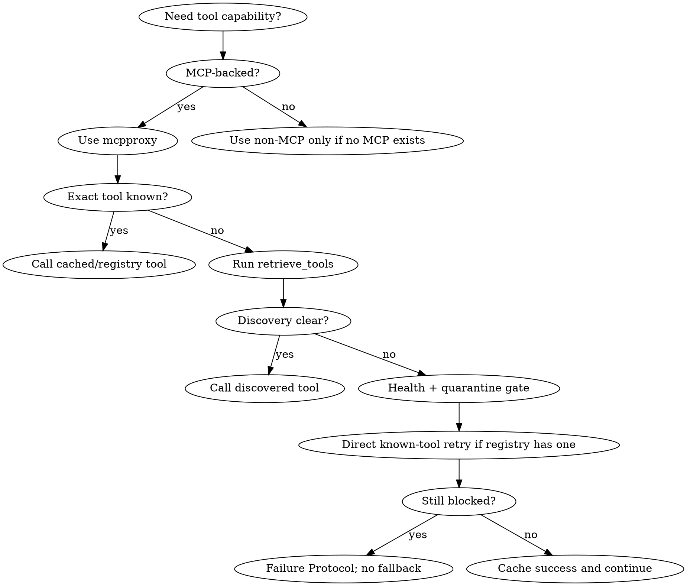

# MCP-Only Tool Discipline

## Mandatory Companion Skill

**Immediately load `mcp-tool-registry` whenever this skill is loaded.**

That registry owns known exact `server:tool` names, mcpproxy wrappers, argument templates, and per-tool guard notes. This skill owns policy: when and how MCP must be used, how to recover when discovery is noisy, and when to stop instead of falling back to local tools.

If the runtime cannot auto-load dependencies from frontmatter, manually load `mcp-tool-registry` before the first MCP-backed action.

## Core Invariant

If a capability is available through MCP, it MUST be executed through `mcpproxy`.

Do not use local/native fallback tools for capabilities covered by MCP: filesystem, IDE actions, search, edits, VCS, tests, build/run commands, browser automation, documentation lookup, GitHub, databases, cloud APIs, or other external integrations.

## MCP Coverage: Local Fallback Is Blocked

When any row is MCP-backed in the active environment, use MCP and do not use local/native fallback:

| Capability | Use MCP for | Local/native fallback blocked |
| --- | --- | --- |
| Filesystem/project files | read, list, create, edit, format, inspect diagnostics | `cat`, `sed`, `awk`, shell redirection, native file editors |
| Search/navigation | text search, regex search, file lookup, symbols, references | `grep`, `rg`, `find`, `fd`, local indexers |
| VCS/repository state | status, diff, log, blame, stage, commit, push | `git status`, `git diff`, `git log`, `git add`, `git commit`, `git push` |
| Tests/build/run | unit tests, typecheck, lint, build, run configurations, console output | `dotnet test`, `npm test`, `bun test`, `make`, direct terminal commands |
| Browser/app automation | navigate, snapshot, console/network, screenshot, forms/clicks | non-MCP browser tools, ad-hoc scripts, manual browser automation |
| Documentation lookup | library docs, API references, official docs MCPs | native web fetch/search when an MCP docs server exists |
| Remote services | GitHub, cloud APIs, issue trackers, CI/CD | direct API calls, CLIs, local credentials outside MCP |
| Databases | schema inspect, query, migrations, DB admin | direct DB CLIs or drivers outside MCP |

If no MCP server exists for a capability, say so. If an MCP server exists but fails, run the Failure Protocol. Do not quietly switch to local tools.

## First 30 Seconds

1. Load `mcp-tool-registry` and keep it in context.
2. Determine whether the requested capability is MCP-backed.
3. For unknown or disputed capabilities, run `mcpproxy_retrieve_tools` before first use.
4. For known stable capabilities, use an exact `server:tool` from `mcp-tool-registry` or a successful call cached earlier in this session.
5. Select the wrapper from fresh discovery or the registry's cached `call` value.
6. Include `intent_reason` and `intent_data_sensitivity` on every proxied call.
7. If discovery is missing, unclear, or contradictory, use the health/security gate before taking any action outside MCP.

## Non-Negotiable Contract

- **Use mcpproxy first.**
- **Never guess tool names.** Use only exact names returned by discovery, listed in `mcp-tool-registry`, or proven by a successful call earlier in the same session.
- **Use the discovered/cached wrapper only:**
  - `call_tool_read` / `call: read` → `mcpproxy_call_tool_read`
  - `call_tool_write` / `call: write` → `mcpproxy_call_tool_write`
  - `call_tool_destructive` / `call: destructive` → `mcpproxy_call_tool_destructive`
- **Treat wrapper choice as routing, not safety.** Some write-like tools may currently route through the read wrapper. Obey registry `risk`/`guard` notes and user-confirmation rules anyway.
- **Every proxied call includes audit intent:**
  - `intent_reason`: why this call is needed for the current user request.
  - `intent_data_sensitivity`: `public`, `internal`, `private`, or `unknown`.
- **Continue truncated results** with `mcpproxy_read_cache`.
- **Do not stage, commit, push, delete, remote-write, or run destructive operations** unless the current user request explicitly asks for that action or confirms it after you ask.
- **Fail closed.** If MCP cannot perform the action, stop and report the MCP-only recovery path. Do not silently switch to local tools.

## Forbidden Fallback Examples

| Temptation | Required MCP-first behavior |
| --- | --- |
| "I'll just `cat` the file." | Use file-read MCP or IDE read tool. |
| "I'll `rg`/`grep` quickly." | Use MCP search tools. |
| "I'll patch with `sed` or shell redirection." | Use MCP file-edit/create tools and read back the result. |
| "I'll run `git diff/status/log`." | Use VCS MCP tools. |
| "I'll run `dotnet test`, `npm test`, or `bun test`." | Use test/build/script MCP tools if available. |
| "I'll call the GitHub CLI/API directly." | Use GitHub MCP tools. |
| "I'll use a browser/script outside MCP." | Use browser MCP tools. |
| "MCP failed, local is faster." | Run Failure Protocol and stop. |

These are policy violations even for read-only actions when an MCP equivalent exists.

## Session MCP Cache Template

Maintain a session-local cache after every successful discovery, registry lookup, or direct call:

```text
Session MCP cache entry:
- capability:
- server:tool:
- wrapper: mcpproxy_call_tool_read | mcpproxy_call_tool_write | mcpproxy_call_tool_destructive
- key args: projectPath / owner+repo / workingDirectory / etc.
- risk/guard:
- source: fresh discovery | mcp-tool-registry | successful direct call
```

Use the cache to avoid repeated discovery. Do not use it to bypass safety gates or fresh schema conflicts.

## MCP-Only Decision Flow



## Discovery and Cache Policy

Use discovery for unknown capabilities, not for every call. Maintain a session-local cache of exact `server:tool` names, wrappers, and required argument patterns after successful discovery, registry lookup, direct-call success, or tool/security inspection.

When capability is uncertain, run up to three narrowing discovery queries:

1. Broad capability query.
2. Server-scoped query.
3. Action-scoped query with likely tool words.

If results are still sparse or irrelevant, run one sanity pass with `include_stats=true`. Do not infer unavailability from one poor retrieval result.

## Registry Tie-Breaker for Retrieval Misses

Retrieval can be noisy. Before declaring a known MCP capability unavailable:

1. Complete the discovery/cache policy above.
2. Check relevant exact entries in `mcp-tool-registry`.
3. Confirm server health with `mcpproxy_upstream_servers`.
4. Confirm quarantine/tool state with `mcpproxy_quarantine_security`.
5. If the registry contains an exact likely tool, attempt one direct call with that exact `server:tool` and cached wrapper only when the action is read-only or already allowed by the current user request and registry guard.
6. If that call fails, include the raw error in the Failure Protocol.

Never use a registry tie-breaker to perform a destructive, remote-write, VCS-write, browser-mutation, or code-execution action without explicit current user intent.

After a direct registry invocation succeeds, cache that tool and wrapper for the rest of the session.

## Health and Security Gate

Run this gate whenever discovery is missing, unclear, contradictory, or a cached tool fails unexpectedly:

1. `mcpproxy_upstream_servers` to inspect configured servers and connection state.
2. `mcpproxy_quarantine_security` for the relevant server/tool state.
3. If the server is disabled, quarantined, missing credentials, or unhealthy, stop and report the MCP-only recovery step.

Never bypass quarantine or security status by using a local fallback.

## Routing Sources of Truth

Use these in order:

1. Current user instruction and repository guidance (`AGENTS.md`, project skills, explicit task constraints).
2. Fresh `mcpproxy_retrieve_tools` output for exact tool names, wrappers, and schemas.
3. `mcp-tool-registry` for stable exact names and argument templates.
4. Successful calls cached earlier in this session.

If fresh discovery conflicts with the registry, fresh discovery wins for wrapper/schema. Do not keep retrying the stale registry entry. Use the fresh schema if found, and note that the registry needs an update.

## Safety Gates for High-Impact Actions

These require explicit current user intent, even when a registry entry exists and even when the wrapper is `read`:

| Action type | Requirement |
| --- | --- |
| File edits/creation/formatting | User requested the change; read back or inspect after editing. |
| Test/build/run commands | User requested verification or execution; state that code/processes may run. |
| Stage/commit/push | User explicitly requested staging, committing, or pushing in this task. |
| Deletes/destructive operations | Ask for confirmation unless the user already gave precise destructive instruction. |
| Remote writes/API mutations | Require explicit current request; prefer dry-run/read checks first. |
| Browser JavaScript/forms/clicks | Keep inspection read-only unless mutation is requested. |

## Failure Protocol: No Fallback

When MCP execution fails and recovery is not immediate, STOP and output this 5-part report:

1. **Discovery Queries:** exact `mcpproxy_retrieve_tools` queries used.
2. **Registry Entries Checked:** exact `server:tool` entries considered from `mcp-tool-registry`.
3. **Server Health:** relevant `mcpproxy_upstream_servers` status.
4. **Security Status:** relevant `mcpproxy_quarantine_security` state.
5. **Failing Tool Evidence + Next MCP-Only Step:** exact tool, wrapper, raw error, and one next step: auth, restart, enable, unquarantine, install/configure server, narrower rediscovery, user confirmation, or registry refresh from fresh schema.

Do not switch to native/local tools after this report.

## Common Mistakes

| Severity | Mistake | Correct behavior |
| --- | --- | --- |
| BLOCKER | Using local/native tools because MCP failed | Run Failure Protocol and stop. |
| BLOCKER | Guessing a `server:tool` name | Use discovery, registry, or session cache only. |
| BLOCKER | Loading this skill without `mcp-tool-registry` | Load the registry immediately. |
| BLOCKER | Ignoring `call_with`/registry `call` | Use the matching mcpproxy wrapper. |
| BLOCKER | Missing intent metadata | Add `intent_reason` and `intent_data_sensitivity` every time. |
| BLOCKER | Staging/committing/pushing without explicit request | Stop; ask or wait for explicit instruction. |
| BLOCKER | Using `cat`/`rg`/`git`/test CLIs when MCP equivalents exist | Use MCP equivalents or fail closed. |
| MAJOR | Treating `call: read` as harmless | Check `risk` and `guard`; wrapper is routing only. |
| MAJOR | Declaring MCP unavailable after one sparse query | Run narrowing discovery, health/quarantine, and registry tie-breaker. |
| MAJOR | Reusing a stale registry schema after fresh discovery disagrees | Fresh discovery wins; note registry refresh needed. |
| MAJOR | Using ambiguous project/server when a project path is known | Pass known project/root arguments and follow project routing. |
| MINOR | Re-discovering stable tools repeatedly | Cache exact successful tool names for the session. |
| MINOR | Ignoring truncation notices | Continue with `mcpproxy_read_cache`. |
